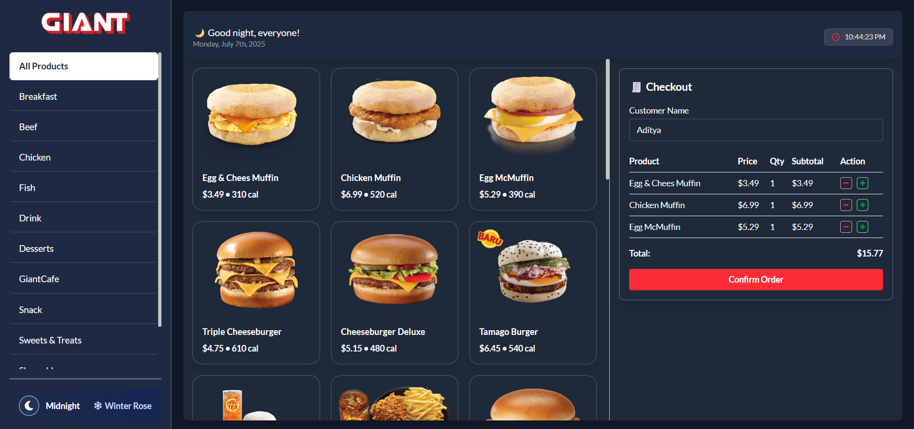
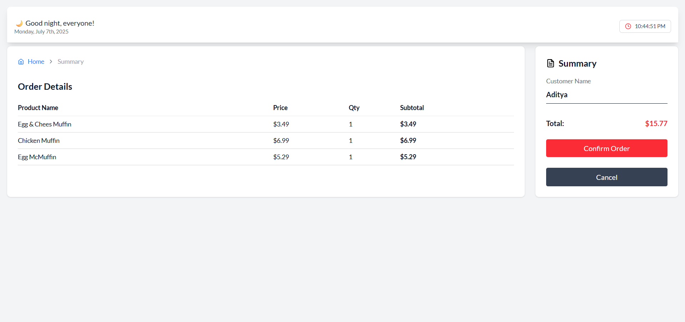
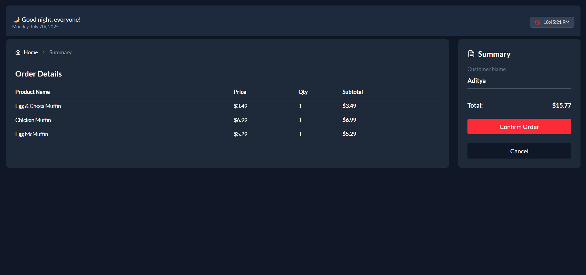
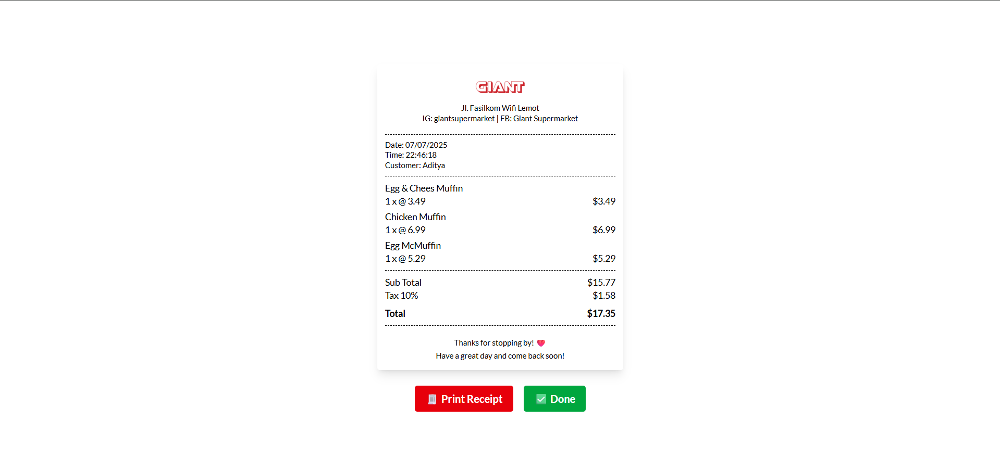
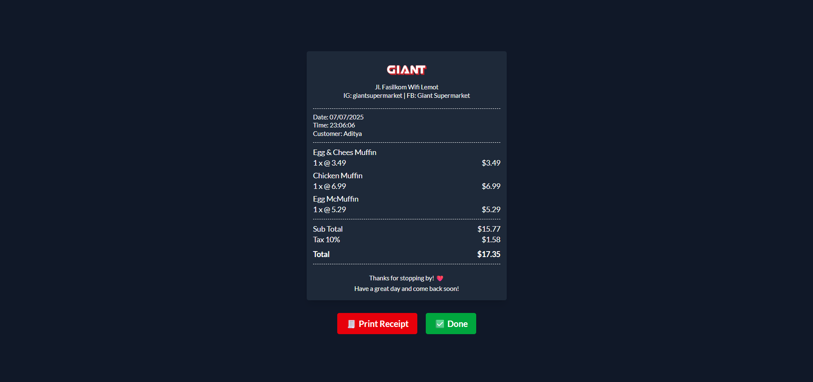
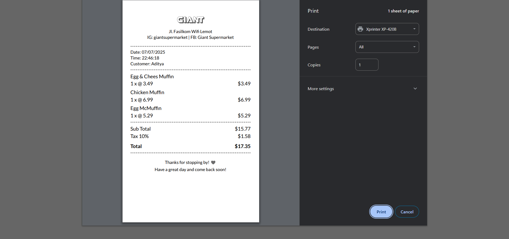
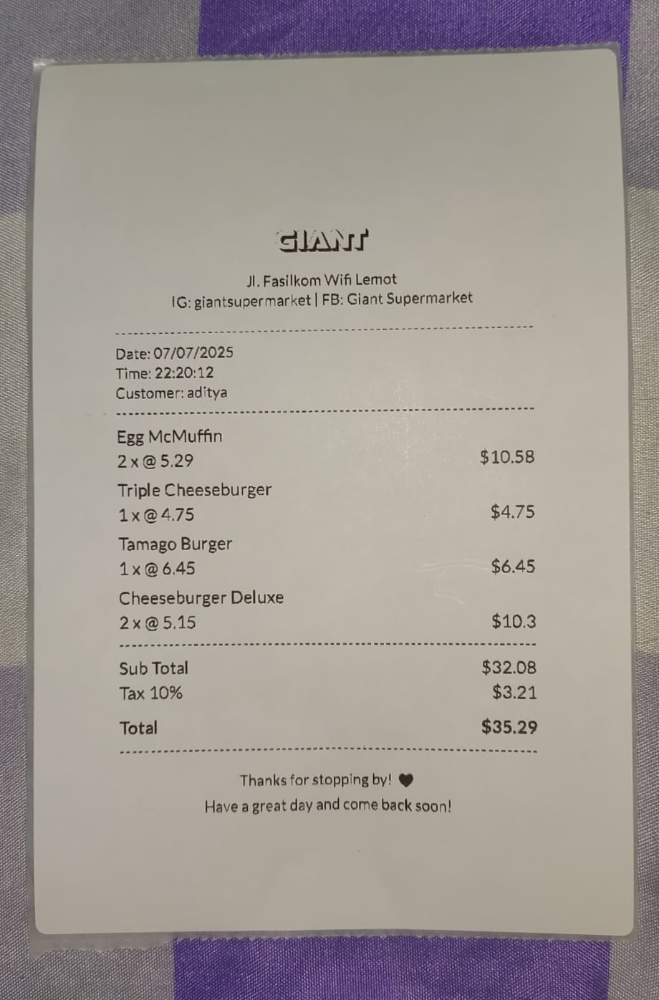
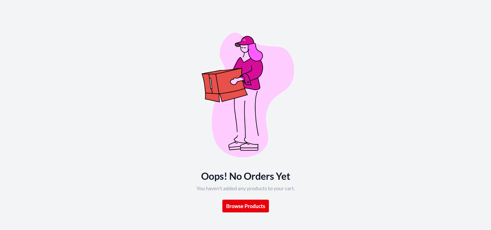
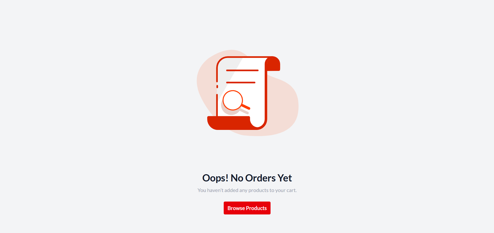
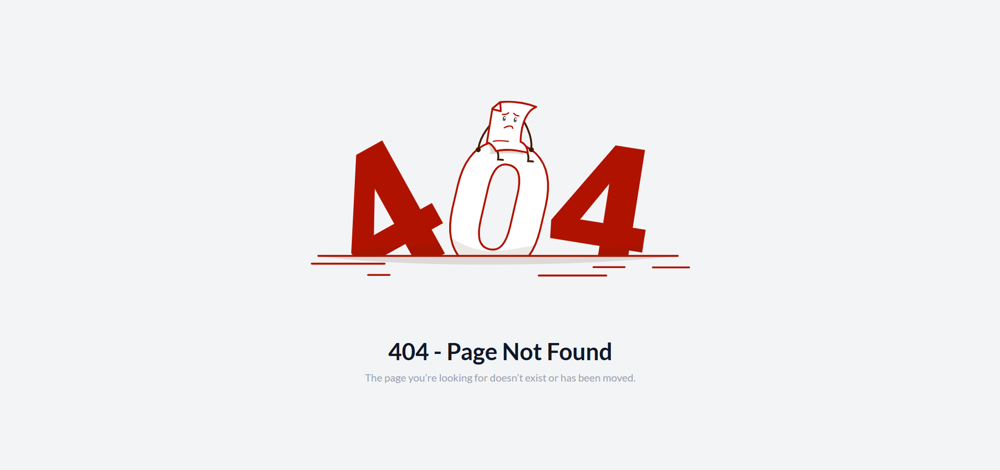

# 🍔 Giant Food Dashboard

A modern food ordering dashboard with:

- 🌗 **Dark / Light Mode Switch**
- 🍽️ **Food Category Filter**
- 🧾 **Checkout Form with Receipt Print Preview**

---

## ☀️ Dashboard Light Mode


---

## 🌙 Dashboard Dark Mode



---

## ☀️ Order Detail Light Mode



---

## 🌙 Order Detail Dark Mode



---

## ☀️ Receipt Light Mode



---

## 🌙 Receipt Dark Mode



---

## Receipt Print Example



---

## Receipt Print Result Example



---

## Order Confirm


---

## No Order Condition



---

## Try Access Success Page No Order Condition



---

## 404 Not Found



---

## 🚀 Features

- 🌗 Dark / Light mode switch
- 🍽️ Dynamic food category filtering
- ➕ Quantity control with real-time updates
- 🧾 Checkout with receipt print preview
- 📃 Real printer layout (58mm / 100mm x 150mm)

---

## 🛠️ Tech Stack

- ⚛️ React + Vite
- 🎨 TailwindCSS
- 💡 React Icons
- 🎞️ Lottie Files for animation
- 🗂️ JSON Server (Mock backend)

---

## 📦 Installation

```bash
# Install all dependencies
npm install

# Start the development server
npm run dev
```

## Json Server

```bash
# In a separate terminal or code editor
json-server --watch db.json --port 3000
```
